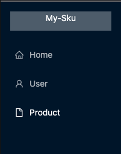
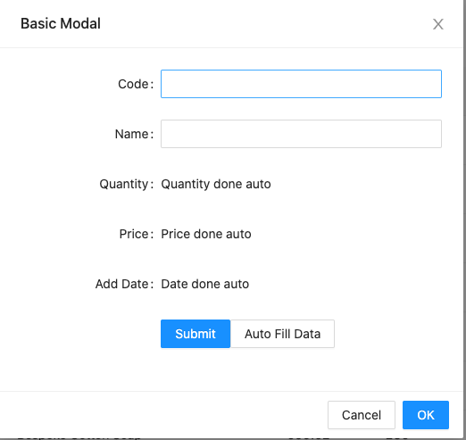
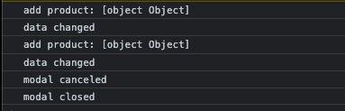
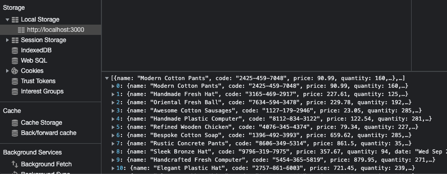

## Feature List

### Browsing through Nav bar on the left

### 

### Click Products
* listing the inventory

* Add new product to the list
  * Option 1: create manually by providing **Code** and **Name**
    
  * Option 2: click **Auto Fill Data** to generate data self

* Action: **Delete**
  * Remove a row from the data list
  
* Dev Progress
  * Console Outputs for clarity

 

  * LocalStory: this is where all products are stored
    