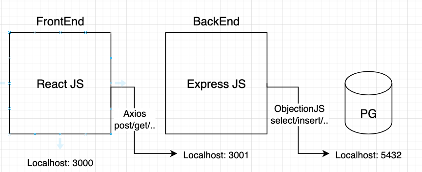

## Current Todo

#### Instruction

```bash
docker build -f Dockerfile.backend -t my-sku-backend .
```
```bash
docker build -f Dockerfile.frontend -t my-sku-frontend .
```
```bash
docker-compose up -d
```

---

History

* Backend <---> Postgresql

the majority difference is the usage of Postgresql 
and the corresponding ORM(objection js) on the backend.

Koa2 is used to be the backend since it's 
the next generation of Express JS

* Frontend <---> Backend

the communication between frontend and backend is
decided to use redux's rtk query which provide convenient
and support.



---

## Feature List

### Side Navigator

### 

---

### Products Page
* listing the inventory


---

### Product Management


---

Action: **Search**
* search by Barcode
  * with additional barcode reader from QuaggaJS
* search by name
  * return a list of matching
  
`All actions in the table are supported`

---


* Action: **Add**
  * generate fake code 
  * scan from a real product with scanner

---

* Action: **Delete** `as the same before`
  * Remove a row from the data list
  
---

* Data Structure migrates to Redux
  * reducer is used to store temporary date