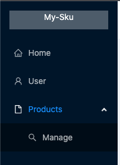
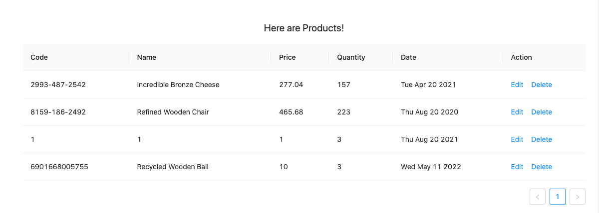
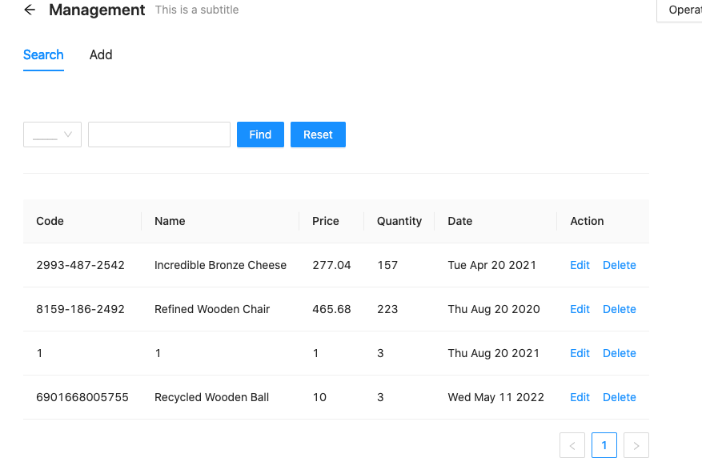
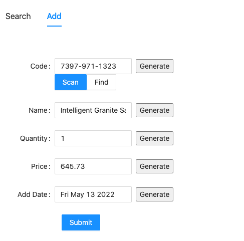

## Feature List

### Side Navigator

### 

---

### Products Page
* listing the inventory

---

### Product Management

---

Action: **Search**
* search by Barcode
  * with additional barcode reader from QuaggaJS
* search by name
  * return a list of matching
  
`All actions in the table are supported`

---

* Action: **Add**
  * generate fake code 
  * scan from a real product with scanner

---

* Action: **Delete** `as the same before`
  * Remove a row from the data list
  
---

* Data Structure migrates to Redux
  * reducer is used to store temporary date